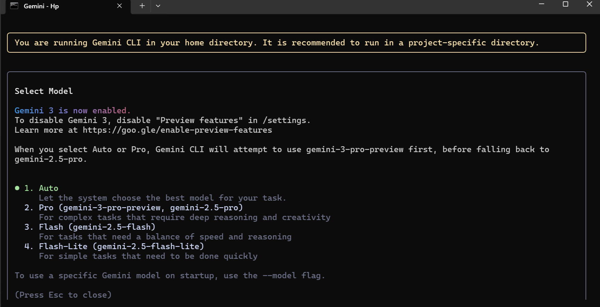
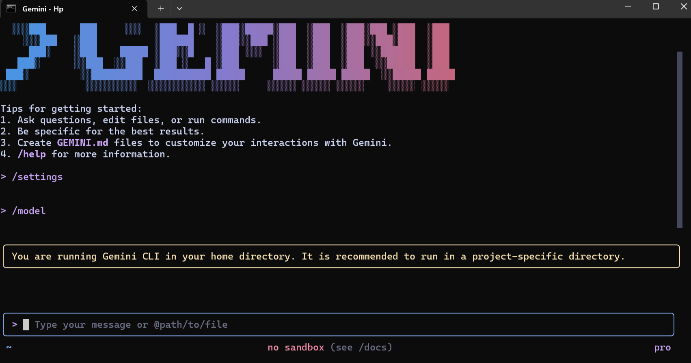

# AI-Driven Development - 30-Day Challenge

## Task-3 submission:
**Name: Asia parveen**
**Roll no: 00441760**

# 🌟 PART A — Research Questions (Short

## Answers)

## 1. What new improvements were introduced in Gemini 3.0?

## Answer:

Gemini 3.0 introduces faster response time, better accuracy, improved reasoning, stronger multimodal understanding (text, image, code, audio), and lower latency for real-time tasks. It also provides improved memory, context handling, and more stable API performance.

## 2. How does Gemini 3.0 improve coding & automation workflows?

## Answer:

Gemini 3.0 offers better code generation, smarter debugging, stronger tool-calling, and more accurate understanding of large codebases. It automates repetitive tasks faster, produces cleaner code, and integrates smoothly with Google AI Studio, Gemini API, and IDE extensions.

## 3. How does Gemini 3.0 improve multimodal understanding?

## Answer:

Gemini 3.0 can analyze images, text, audio, and documents at the same time more accurately. The model understands context better, detects details more precisely, and supports real-time multimodal reasoning, making it more reliable for vision-based tasks and document analysis.

## 4. Name any two developer tools introduced with Gemini 3.0.

## Answer:

### 1- Gemini API (updated for 3.0 models)

### 2- Google AI Studio (enhanced developer environment)
 #### (Also available: Gemini Code Assist, Realtime API, and lightweight edge models.)

# 🌟 PART B — Practical Task (With Screenshot):

### Task:

You must complete the following steps:

### Update the Gemini 3.0 model. DONE it.

### Using the /model command in Gemini CLI, update the Gemini model to the latest version
(3.0). DONE it

